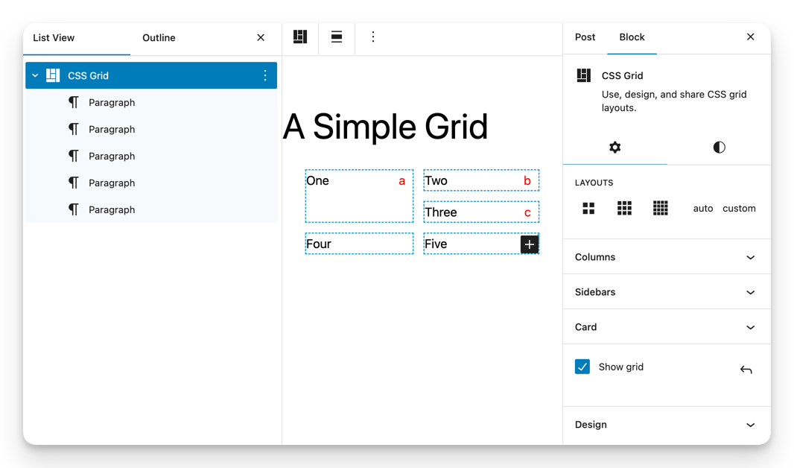
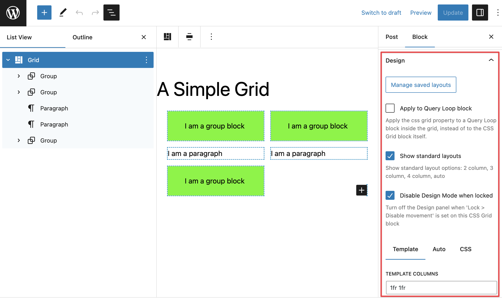
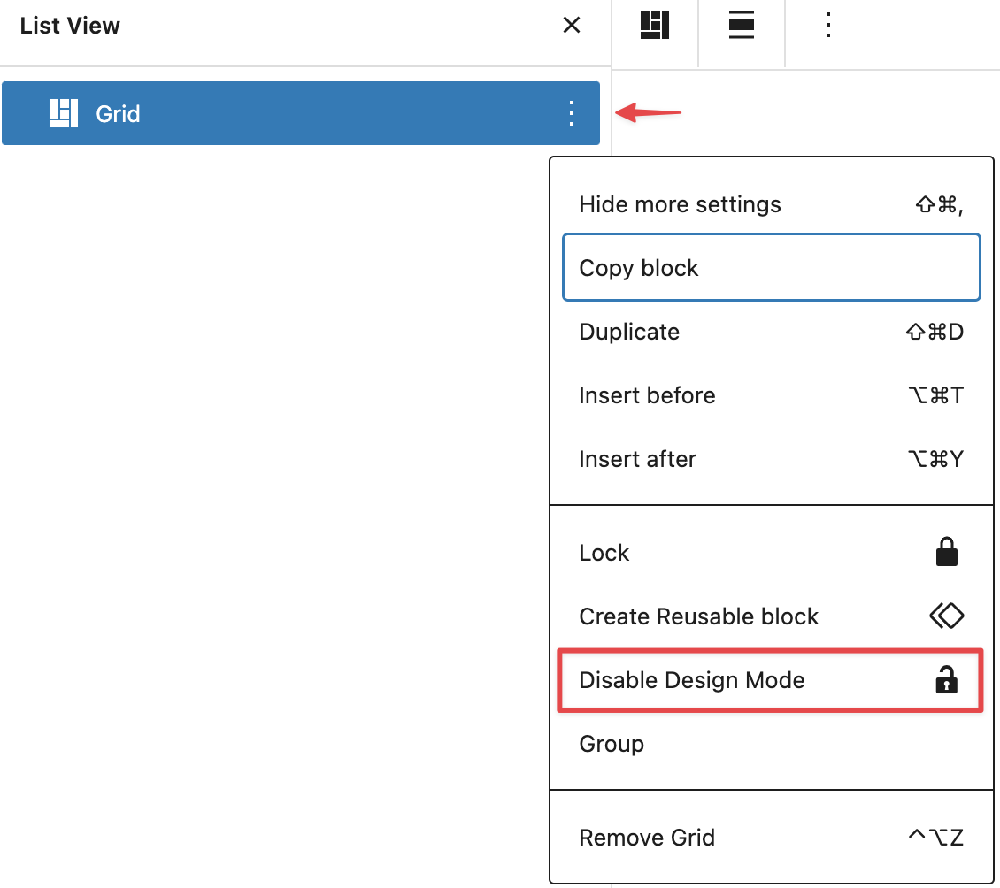

# WordPress CSS Grid Block for Intrinsic Design

A proof of concept for a core CSS grid block for intrinsic design

See discussion at WordPress Gutenberg Github issue #49084: "[Designing a Core CSS Grid Block for Intrinsic Design](https://github.com/WordPress/gutenberg/issues/49084)".

## What problem does this address?

In recent releases, [WordPress has increasingly embraced intrisic design](https://developer.wordpress.org/news/2023/02/intrinsic-design-theming-and-rethinking-how-to-design-with-wordpress/) as a fundamental modern styling methodology.

And since the term was coined, CSS Grid has been a central tool of intrinsic design.

The CSS Grid Layout Module offers a grid-based layout system with rows and columns, enabling an endless variety of layouts beyond its simpler cousin, Flexbox. 

Nearly all modern CMSs have adopted CSS grid in some form.

Numerous Gutenberg issues have explored the topic of grids from several angles:

- #4314 Use grid to absorb wide and fullwide alignments
- #18600, #20000 A bespoke grid block implementing almost the full range of grid properties 
- #19254 Blank template potentially exposing a Grid block
- #32443 Query block: CSS Grid for Grid View option
- #44557 layout for Post Template
- #47809 Grid Layout type -- a simplified grid profile for the group block
- The [Layout Grid plugin](https://wordpress.org/plugins/layout-grid/) which implements a responsive 12 column grid system

But a recurring challenge has been to design a user interface that copes with the versatility and complexity of the CSS grid properties.

A CSS grid block design needs to:

- fit the needs of both WordPress users and designers 
- not over-simplify and constrain CSS grid options to the point of limited usefulness

A start-simple approach postpones the UI design issues down the road and constrains the real power of CSS grid, which is in the interplay of its 10 basic properties:

- grid-template-columns/rows/areas
- grid-auto-columns/rows/flow
- row/column-gap
- grid-column/row

A fully-functional CSS grid block needs to consider 3 potentially conflicting use flows:

- **Using**: A CSS grid block should be quick and easy to use, like the row block but with more layout options, without learning CSS grid.
- **Designing**: Designers need access to all the CSS grid properties, including column, row, and area templates. CSS grid design involves some level of CSS knowledge.
- **Sharing/locking**: Pattern, site and theme builders need to share grid layout designs in a way that it is easy for users to select and configure, but also lockable so that pre-built designs are used as intended.

A core design question is whether it is necessary, or feasible, to design an "ultimate CSS grid user interface" that is both easy for users without CSS knowledge and flexible enough for designers to access all of CSS grid's power. 

Or perhaps multiple user interfaces on top of the css grid properties might be more tailorable to particular uses.

## What is your proposed solution?

Here is a proof-of-concept CSS grid block that fully implements CSS grid and addresses the use flows of using, designing, and sharing/locking.

For users, it is easy to use, like a row block with more layout options:

There is a design panel for designers to make and save grid layouts for users to use:

The block supports per-instance custom CSS, to enable advanced uses like different template areas at breakpoints. The placeholder ".wp-grid-name-class" is auto-replaced with the actual name of the grid block instance.

Note that the css grid block works with the Query Loop block -- just put a Query Loop inside it and set the flag.

## Sharing/locking

- Designers can create, name, save, and share layouts inside a specific block instance. 
- Designers can customize the UI of a specific block to show only their pre-defined layouts, turn off standard layouts, or hide the Design panel.

The Design panel can be turned off in the block settings menu, toggling the "enableDesignMode" block property:

## Why a full-featured-first approach?

This proof of concept block takes an enable-the-power-of-grid approach rather than a start-simple approach to address the question:

Assuming the full power of CSS grid as the starting point rather than an eventual destination (that is, all the basic CSS grid properties), what UI(s) on top would best enable user, designer, and sharing/locking use flows?

There are several reasons to fully examine the UI implications of a full-powered CSS grid at the onset rather than down the road:

- In some simple forms, a CSS grid is a lot like the existing row and column blocks, which already do their jobs well. Focusing on what grid can do fundamentally better and differently requires looking beyond that use case.
- A simple css grid design can seem a lot like CSS flexbox, but the usefulness and power of grid only show up in more sophisticated grid layouts.
- Designing a grid and using a grid may not be best achieved in the same user interface.
- A narrowly envisioned grid use case may be compelling for a particular design, but the point of CSS grid is to enable a very wide range of possible designs. The Web standards process has already deeply considered this in specifying and rolling out CSS grid, so why not leverage that platform-level capability.
- Template areas are a compelling tool for building patterns and sites.
- Sharing and locking grids raises issues beyond those of a group block.
- In essence, the modern Web has given us the powerful design tool of CSS grid. Let's use it!

## Possible refinements

- auto-name each grid with hashing or other technique
- provide slots to add additional UIs for grid selection and design, like a classic 12-column grid
- Add a lock to the locking modal for grid blocks to directly disable design mode
- add a field for free-form names in the template-areas property, beyond single letters
- simplify the underlying CSS, particularly for the editor view, when the :has() pseudo-class is more widely deployed. This would allow removing the flag for enabling an inner Query Loop.
- further isolate grids in a server-rendered web component, perhaps when [declarative Shadow DOM](https://developer.chrome.com/en/articles/declarative-shadow-dom/) is more widely deployed
- provide an instance-specific custom Javascript field, to facilitate designing  and sharing interactive grids

## Implementation: block attributes

The block level implementation attempts to start with the smallest feasible step that can be useful on its own.

Or framed more precisely: what is the minimum viable solid foundation which would support all future grid layouts and UIs? Even if there were no UI at all?

In implementation terms, what block attributes implement the Grid Module spec and would always reliably underly any grid layout or UI?

Removing short-hand properties, the full Grid Module spec is 10 basic properties:

- grid-template-columns/rows/areas
- grid-auto-columns/rows/flow
- row/column-gap
- grid-column/row

These 10 properties work together, not separately, and have defaults. How to express as block attributes?

- 5 are text attributes (the 3 templates and auto-columns/rows)
- 1, grid-auto-flow, is an enum
- 2, row/column-gap, are like gap for which block UI is well-understood

That leaves grid-column/row, technically a property on children of the grid, like flexbox also has child properties.

The poc adopts the single alphabetical letter naming convention. It is versatile and maps intuitively to the WordPress inner block architecture. A possible refinement would be a list of free-form names, which some grid layout designs may favor.

By aligning to the Grid Module, we have a solid foundation on which grid work can reliably move forward, while being forwardly compatible with upcoming enhancements like masonry and subgrid.

The next step on a solid foundation is to consider the use flows of use, design, and sharing/locking, which the poc block then explores.

Hopefully, a proof of concept of a fully functional css grid block will inspire more consideration of how to extend WordPress's intrinsic design capabilities.