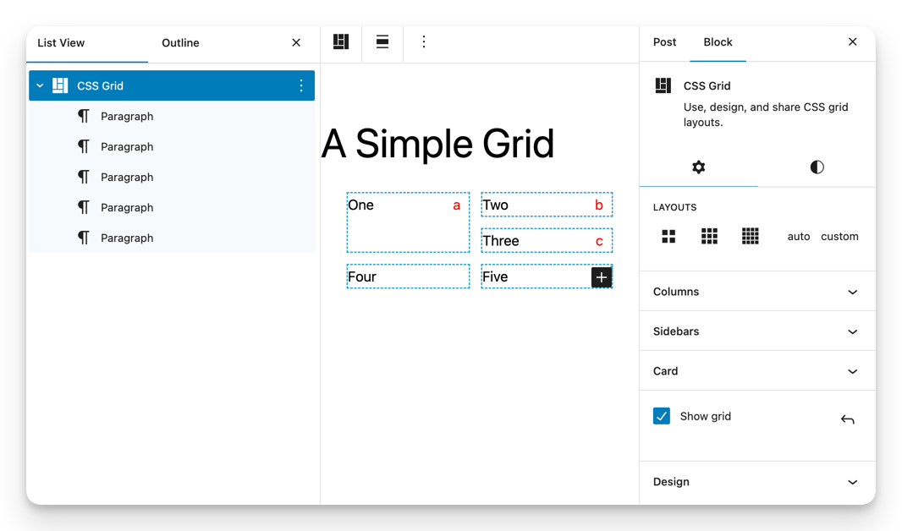

# CSS grid block & intrinsic grid layout system

> See [“Designing a Core CSS Grid Block for Intrinsic Design“](https://github.com/WordPress/gutenberg/issues/49084), WordPress Gutenberg issue #49084.

In recent releases, [WordPress has increasingly embraced intrinsic design](https://developer.wordpress.org/news/2023/02/intrinsic-design-theming-and-rethinking-how-to-design-with-wordpress/) as a fundamental modern styling methodology.

And since the intrinsic term was coined, the CSS Grid standard has been a central tool of intrinsic Web design.

This CSS grid block proposes a full-featured grid layout system that:

-   fits the needs of both WordPress users and designers
-   provides a customizable and extensible user interface
-   provides access to the full CSS grid specification for designers without overwhelming users with complexity or the need to learn CSS

Use flows:

Using

-   Quick and easy to use
-   “Click the icon” to switch grid layouts
-   Panels for customizing columns, sidebars, & cards
-   No need to learn CSS grid properties

Designing

-   Design mode access to all CSS grid properties
-   Name & save custom grid layouts
-   Block-instance CSS to add intrinsic behaviors
-   Develop SlotFills to extend UI

Sharing/Locking

-   Pattern, site and theme builders can share grid layout designs that are easy for users to select
-   Design mode can be locked so designs are used as intended

For more information, see the [overview](https://boot2wp.com/css-grid/) and [examples](http://boot2wp.local/css-grid-block/examples/).

See also an [example SlotFill plugin](https://github.com/boot2wp/b2wp-grid-slotfill).
